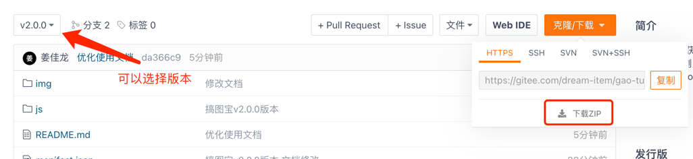
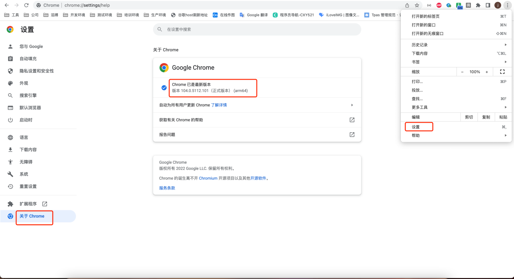
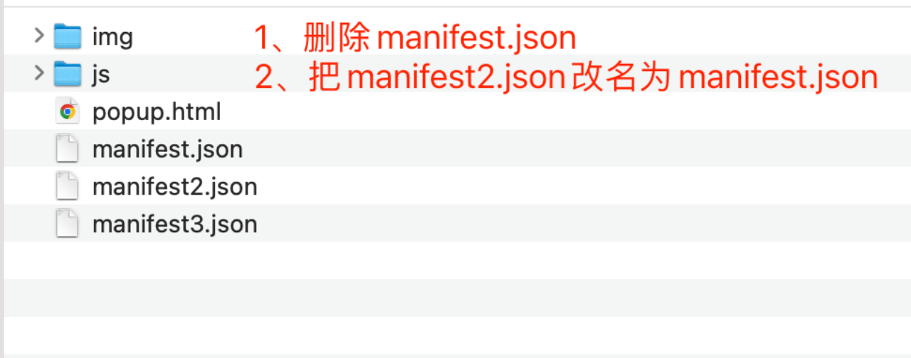
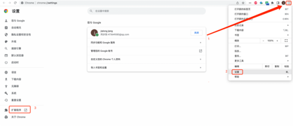
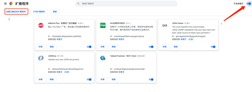
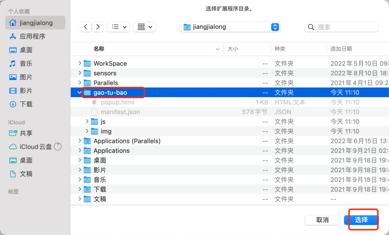
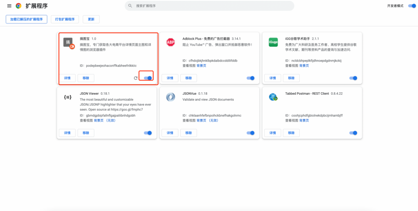
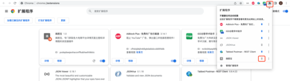
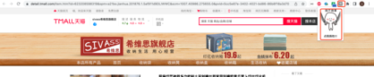

# gao-tu-bao

#### 介绍
搞图宝,专门获取各大电商平台详情页面主图和详情图的浏览器插件
现已支持京东、淘宝、天猫、coupang、1688、naver、gmarket

#### 使用教程
1.当前页面点击下载zip，并解压

2.打开谷歌浏览器，右上角三个点，点击设置，然后打开关于Chrome

3.如果当前版本最前面的数字，小于88，就要把解压后的文件里面的

4.打开谷歌浏览器，右上角的三个点，点击后打开设置界面

5.打开拓展程序页面后，点击右上角开启开发者模式，然后就会出现加载以解压的扩展程序按钮

6.点击加载以解压的扩展程序后，选择插件的根目录

7.然后扩展程序页面就会出现搞图宝插件了，如果未开启，记得点击开启

8.开启后浏览器右上角会出现拓展程序图标，我们把它钉在菜单栏上

9.然后进入各大电商平台详情页上，点击插件图标即可使用

10.如果有不兼容的页面，可以联系我，或者想要支持新的平台也可以联系我
邮箱：473649383@qq.com

